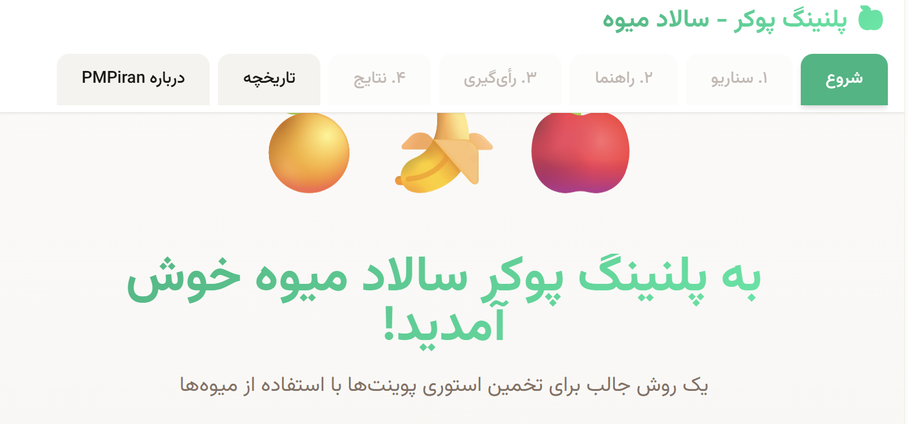

   
  <b>PMPiran</b>

---

  

<h1 align="center">🍓🥝 پلنینگ پوکر - سالاد میوه 🍍🍇</h1>

یک ابزار چابک، خوشمزه و متفاوت برای تخمین استوری پوینت‌ها!  
تقدیم از <b>PMPiran</b> به تیم‌های اسکرام، مدیران پروژه و عاشقان چابک!

---

## 🧠 معرفی

«پلنینگ پوکر - سالاد میوه» یک ابزار ساده، سرگرم‌کننده و کاربردی برای تیم‌های اسکرام است که به شما کمک می‌کند تخمین استوری‌پوینت‌ها را با **تعامل بیشتر، فضای دوستانه‌تر و کمی طعم سالاد میوه 🍓** انجام دهید!

مناسب برای:
- مدیران پروژه و اسکرام‌مسترها
- تیم‌های توسعه نرم‌افزار و چابک
- تسهیل‌گران جلسه Planning

دمو آنلاین ✅  
🔗 **https://mehdimoein-max.github.io/salad-story-points/**

---

## ✨ ویژگی‌ها

- 🍉 محیط سرگرم‌کننده با تم سالاد میوه
- ⚡ سریع، سبک و بدون نیاز به نصب
- 📱 قابل استفاده روی موبایل و دسکتاپ
- 🔐 بدون نیاز به لاگین

---

## 🚀 نحوه استفاده در تیم اسکرام

1. جلسه Planning را شروع کنید  
2. اعضا داستان را خوانده و مخفیانه امتیاز می‌دهند  
3. با یک کلیک امتیازها نمایش داده می‌شوند  
4. اگر اختلاف زیاد بود → بحث، جمع‌بندی، دوباره رأی‌گیری  

> *توصیه:* هر از گاهی کمی آبلیموی مدیریتی هم روی سالاد بریزید تا طعم تصمیم‌ها بهتر شود! 🍋😉

---

## 🧑‍💼 درباره سازنده

این پروژه با عشق، چاشنی خلاقیت و کمی نمک پروژه‌ای توسط:

**Mehdi Moein**  
CEO of **PMPiran**

🔗 LinkedIn:  
[https://www.linkedin.com/in/mehdi-moein/](https://www.linkedin.com/in/mehdi-moein/)  

---

## 🏢 درباره PMPiran

PMPiran مرجع آموزش، مشاوره و ارائه راهکارهای مدیریت پروژه و چابک در ایران است.  
برای آشنایی بیشتر با خدمات ما، به وب‌سایت رسمی مراجعه کنید:

🌐 https://pmpiran.com

---

---

# 🇬🇧 English Version

   
  <b>PMPiran</b>

<h1 align="center">🍓🥝 Planning Poker - Fruit Salad 🍍🍇</h1>

This is a fun, lightweight and Agile-friendly Planning Poker tool designed to help Scrum teams estimate Story Points with a more engaging & enjoyable experience — with a fruity twist!

✅ Live Demo:  
https://mehdimoein-max.github.io/salad-story-points/

---

## ⭐ Features

- Fun & colorful fruit-themed UI
- Lightweight – no login required
- Works on desktop & mobile
- Scrum-friendly flow

---

## 🧠 How to Use in Scrum

1. Start your Planning Meeting  
2. Team members vote silently  
3. Reveal the points together  
4. Discuss gaps and vote again if needed  

A tiny slice of “PM lemon juice” always improves the flavor of decisions 🍋😉

---

## 👤 Author

Built with passion and creativity by:

**Mehdi Moein**  
CEO of **PMPiran**

LinkedIn:  
[https://www.linkedin.com/in/mehdi-moein/](https://www.linkedin.com/in/mehdi-moein/)  

---

## 🏢 About PMPiran

PMPiran is a leading Iranian provider of Project Management training, consulting and Agile solutions.

🌍 https://pmpiran.com

---

